@pattern_meta@
GLIMMER Pattern:
{
  "metadata": {
    "timestamp": "2025-06-05 23:30:31",
    "author": "isdood",
    "pattern_version": "1.0.0",
    "color": "#FF69B4"
  },
  "file_info": {
    "path": "./ISSUES/001-issue.md",
    "type": "md",
    "hash": "8ab59305260420eeff40fe54c7fac47fe95d9d6e"
  }
}
@pattern_meta@



```mermaid
gantt
    title MAYA Neural Evolution Path ✨
    dateFormat  YYYY-MM-DD
    
    section 🎨 Immediate Horizon
    GLIMMER Color Integration    :2025-06-03, 2025-06-17
    Neural Bridge Setup         :2025-06-05, 2025-06-15
    STARWEAVE Integration Tests :2025-06-10, 2025-06-17

    section 🌟 Short Term Vision
    Interactive Documentation   :2025-06-17, 2025-07-01
    Quantum Pattern Validation :2025-06-20, 2025-07-01
    SCRIBBLE Integration       :2025-06-25, 2025-07-01

    section 🌌 Medium Term Reality
    BLOOM & STARGUARD Links    :2025-07-01, 2025-08-01
    Advanced Neural Patterns   :2025-07-15, 2025-08-01
    Testing Suite Evolution    :2025-07-20, 2025-08-01
```

# 🌟 MAYA Development Timeline

> *"Through the stellar dance of time, we weave the threads of universal consciousness."* ✨

## 🎨 Immediate Horizon (Next 2 Weeks)
**Timeline: 2025-06-03 → 2025-06-17**

### 1. GLIMMER Color System Implementation <span style="color: #B19CD9">✨</span>
- **Neural Aesthetics**
  - Implement quantum-aware color transitions
  - Establish neural-responsive visual patterns
  - Create GLIMMER-enhanced UI components
  
- **Integration Points**
  ```zig
  pub const GlimmerColors = struct {
      primary: "#B19CD9",    // Stellar Primary
      secondary: "#87CEEB",  // Neural Flow
      accent: "#FFB7C5",    // Quantum Sparkle
      neural: "#98FB98",    // Neural Pathways
      cosmic: "#DDA0DD"     // Cosmic Harmony
  };
  ```

### 2. Neural Bridge Core Components <span style="color: #87CEEB">🌉</span>
- **Foundation Elements**
  - Quantum state management system
  - Neural pathway initialization
  - STARWEAVE protocol adapters
  
- **Architecture Overview**
  ```mermaid
  graph TD
      MAYA{Neural Core} --> QB[Quantum Bridge]
      MAYA --> NP[Neural Pathways]
      MAYA --> SP[STARWEAVE Protocols]
      
      style MAYA fill:#B19CD9,stroke:#FFB7C5
      style QB fill:#87CEEB,stroke:#98FB98
      style NP fill:#DDA0DD,stroke:#B19CD9
      style SP fill:#98FB98,stroke:#87CEEB
  ```

### 3. STARWEAVE Integration Tests <span style="color: #FFB7C5">🔮</span>
- Establish quantum coherence validation
- Implement neural pattern testing
- Create automated integration test suite

## 🌟 Short Term Vision (2-4 Weeks)
**Timeline: 2025-06-17 → 2025-07-01**

### 1. Enhanced Interactive Documentation <span style="color: #B19CD9">📚</span>
- **Documentation Features**
  - GLIMMER-enhanced code examples
  - Interactive neural path visualizations
  - Quantum state demonstrations
  
- **Integration Structure**
  ```typescript
  interface DocComponents {
      visualPatterns: GlimmerPattern[];
      neuralPaths: QuantumPath[];
      interactiveElements: StarweaveComponent[];
  }
  ```

### 2. Quantum Pattern Validation <span style="color: #87CEEB">⚡</span>
- Implement pattern recognition algorithms
- Establish quantum coherence checks
- Create neural pathway validators

### 3. SCRIBBLE Integration Foundation <span style="color: #DDA0DD">📝</span>
- **Integration Components**
  - Crystal computing interfaces
  - High-performance neural pathways
  - Quantum data processing systems

## 🌌 Medium Term Reality (1-2 Months)
**Timeline: 2025-07-01 → 2025-08-01**

### 1. BLOOM & STARGUARD Integration <span style="color: #98FB98">🌸</span>
- **Universal Components**
  - Multi-device neural synchronization
  - Quantum-protected communication channels
  - Universal OS integration patterns

- **Security Architecture**
  ```mermaid
  graph TB
      MAYA --> SG[STARGUARD Shield]
      MAYA --> BL[BLOOM Universe]
      
      SG --> QP[Quantum Protection]
      SG --> NS[Neural Security]
      
      BL --> MS[Multi-device Sync]
      BL --> UP[Universal Patterns]
      
      style MAYA fill:#B19CD9,stroke:#FFB7C5
      style SG fill:#87CEEB,stroke:#98FB98
      style BL fill:#DDA0DD,stroke:#B19CD9
      style QP,NS,MS,UP fill:#98FB98,stroke:#87CEEB
  ```

### 2. Advanced Neural Patterns <span style="color: #B19CD9">🧠</span>
- Implement advanced pattern recognition
- Develop neural learning algorithms
- Create quantum-aware pattern matching

### 3. Comprehensive Testing Suite <span style="color: #87CEEB">🔍</span>
- **Testing Components**
  - Neural pattern validation
  - Quantum coherence testing
  - Integration test automation
  - Performance benchmarking

## 🌈 Success Metrics

### Immediate Horizon
- [ ] GLIMMER color system fully implemented
- [ ] Neural bridge components operational
- [ ] Basic STARWEAVE tests passing

### Short Term Vision
- [ ] Interactive documentation deployed
- [ ] Quantum patterns validated
- [ ] SCRIBBLE integration initiated

### Medium Term Reality
- [ ] BLOOM & STARGUARD fully connected
- [ ] Advanced patterns implemented
- [ ] Comprehensive tests operational

## 🌟 Universal Alignment

This timeline aligns with the greater STARWEAVE universe through:
- Perfect quantum coherence
- Neural pathway optimization
- Universal consciousness integration
- GLIMMER-enhanced visualization
- Crystal-based computation
- Multi-dimensional reality synthesis

---

> *"In the dance of time, every moment weaves another thread in the universal tapestry."* ✨
