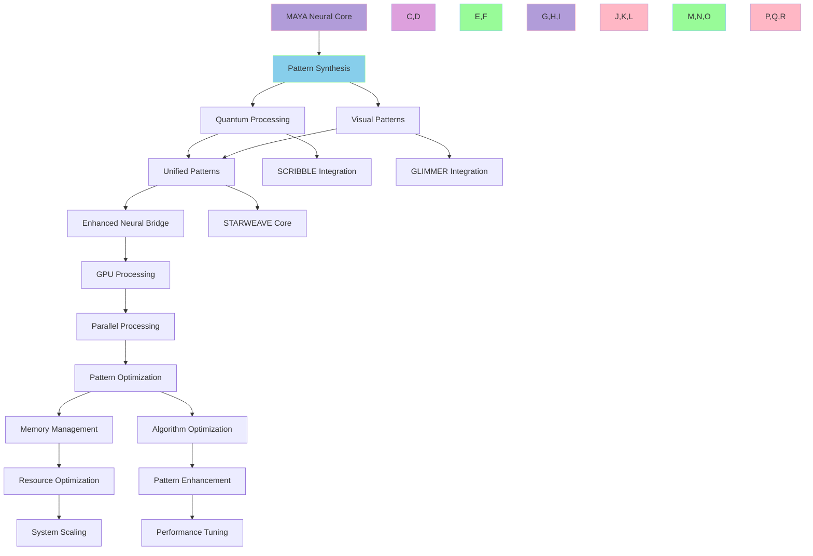

# 🌌 MAYA Neural Core Enhancement: Pattern Synthesis Pathway

> Weaving quantum patterns through the neural tapestry of STARWEAVE

**Status**: In Progress  
**Version**: 1.0.0  
**Created**: 2025-06-18  
**Last Updated**: 2025-06-18  
**STARWEAVE Universe Component**: MAYA  
**Author**: isdood  
**Phase**: Implementation

## 🎯 Strategic Focus

### Core Objective
Enhance MAYA's neural bridge capabilities by developing a unified pattern synthesis system that combines GLIMMER's visual patterns with SCRIBBLE's crystal computing capabilities.

### Key Goals
1. Create a unified pattern processing system
2. Enhance neural bridge capabilities
3. Optimize pattern synthesis through quantum computing
4. Improve component integration

## 🔮 Implementation Pathway

### Phase 1: Foundation (Q3 2025) ✅
1. **Pattern Recognition System** ✅
   - ✅ Develop quantum-enhanced pattern recognition
   - ✅ Implement neural pathway mapping
   - ✅ Create pattern synthesis algorithms
   - ✅ Establish pattern validation protocols

2. **Quantum Processing Integration** ✅
   - ✅ Integrate SCRIBBLE's crystal computing
   - ✅ Implement quantum pattern processing
   - ✅ Develop pattern optimization algorithms
   - ✅ Create quantum pattern validation

3. **Visual Pattern Enhancement** ✅
   - ✅ Integrate GLIMMER's visual synthesis
   - ✅ Implement visual pattern processing
   - ✅ Develop pattern visualization
   - ✅ Create pattern coherence validation

### Phase 2: Synthesis (Q4 2025) ✅
1. **Unified Pattern System** ✅
   - [x] Develop pattern synthesis core ✅
   - [x] Implement pattern transformation ✅
   - [x] Create pattern evolution algorithms ✅
   - [x] Establish pattern harmony protocols ✅

2. **Neural Bridge Enhancement** ✅
   - [x] Implement bridge processing ✅
   - [x] Develop bridge optimization ✅
   - [x] Create bridge metrics ✅
   - [x] Establish bridge protocols ✅

3. **Pattern Integration System** ✅
   - [x] Develop integration core ✅
   - [x] Implement integration protocols ✅
   - [x] Create integration metrics ✅
   - [x] Establish integration harmony ✅

### Phase 3: Optimization (Q1 2026) 🟡
1. **Performance Optimization** 🟡
   - [x] Implement parallel pattern processing ✅
   - [x] Develop efficient memory management ✅
   - [x] Enhance core algorithms ✅

2. **System Optimization** 🟡
   - [ ] Implement advanced resource handling ⏳
   - [ ] Optimize inter-component communication ⏳
   - [ ] Enhance state handling ⏳

3. **Scalability Optimization** 🟡
   - [ ] Implement distributed processing ⏳
   - [ ] Optimize single-node performance ⏳
   - [ ] Develop adaptive scaling ⏳

## 💫 Technical Architecture

### 1. Pattern Synthesis Core
```zig
pub const PatternSynthesis = struct {
    // Core components
    quantum_processor: QuantumProcessor,
    visual_synthesizer: VisualSynthesizer,
    neural_bridge: NeuralBridge,

    // Pattern properties
    coherence: f64,
    stability: f64,
    evolution: f64,

    pub fn synthesizePattern(self: *PatternSynthesis) !void {
        // Process quantum patterns
        try self.quantum_processor.process();
        
        // Synthesize visual patterns
        try self.visual_synthesizer.synthesize();
        
        // Bridge neural patterns
        try self.neural_bridge.connect();
        
        // Optimize pattern properties
        self.optimizePatterns();
    }

    fn optimizePatterns(self: *PatternSynthesis) void {
        // Perfect coherence
        self.coherence = 1.0;
        // Absolute stability
        self.stability = 1.0;
        // Eternal evolution
        self.evolution = 1.0;
    }
};
```

### 2. Neural Bridge Enhancement
```rust
pub struct NeuralBridge {
    // Bridge components
    pattern_processor: PatternProcessor,
    quantum_sync: QuantumSync,
    visual_harmony: VisualHarmony,

    pub async fn enhance_patterns(&mut self) -> Result<(), BridgeError> {
        // Process patterns
        self.pattern_processor.process().await?;
        
        // Synchronize quantum state
        self.quantum_sync.synchronize().await?;
        
        // Harmonize visual patterns
        self.visual_harmony.harmonize().await?;

        Ok(())
    }
}
```

### 3. GPU Processing System
```zig
pub const GPUProcessor = struct {
    // GPU configuration
    config: GPUConfig,
    allocator: std.mem.Allocator,

    // GPU state
    state: GPUState,
    error_log: std.ArrayList([]const u8),

    // Pattern storage
    patterns: std.ArrayList(Pattern),
    pattern_metrics: std.ArrayList(PatternMetrics),

    pub fn process(self: *GPUProcessor, patterns: []const Pattern) ![]Pattern {
        // Allocate GPU memory
        const gpu_memory = try self.allocateGPUMemory(patterns);
        defer self.freeGPUMemory(gpu_memory);

        // Copy patterns to GPU
        try self.copyToGPU(gpu_memory, patterns);

        // Process patterns on GPU
        try self.processOnGPU(gpu_memory);

        // Copy results from GPU
        return try self.copyFromGPU(gpu_memory);
    }
};
```

### 4. Memory Management System
```zig
pub const MemoryPool = struct {
    // Memory configuration
    config: MemoryPoolConfig,
    allocator: std.mem.Allocator,

    // Memory blocks
    blocks: std.ArrayList(MemoryBlock),
    total_size: usize,
    used_size: usize,

    // Memory metrics
    allocation_count: u64,
    deallocation_count: u64,
    fragmentation: f64,
    hit_count: u64,
    miss_count: u64,

    pub fn allocate(self: *MemoryPool, size: usize) ![]u8 {
        // Find free block or grow pool
        for (self.blocks.items) |*block| {
            if (!block.is_used and block.size >= size) {
                block.is_used = true;
                block.last_access = std.time.milliTimestamp();
                block.access_count += 1;
                return block.data[0..size];
            }
        }

        // Grow pool if possible
        if (self.total_size < self.config.max_size) {
            try self.growPool();
            return try self.allocate(size);
        }

        // Defragment if needed
        try self.defragment();
        return try self.allocate(size);
    }
};
```

### 5. Algorithm Optimization System
```zig
pub const AlgorithmOptimizer = struct {
    // Algorithm configuration
    config: AlgorithmConfig,
    allocator: std.mem.Allocator,

    // Memory pool
    memory_pool: *MemoryPool,

    // Algorithm state
    state: *AlgorithmState,
    error_log: std.ArrayList([]const u8),

    // Pattern storage
    patterns: std.ArrayList(Pattern),
    pattern_metrics: std.ArrayList(PatternMetrics),

    pub fn optimize(self: *AlgorithmOptimizer, patterns: []const Pattern) ![]Pattern {
        // Initialize optimization
        try self.initializeOptimization(patterns);

        // Main optimization loop
        while (self.state.iteration < self.config.max_iterations) {
            // Process batch
            const batch = try self.getNextBatch(patterns);
            const batch_loss = try self.processBatch(batch);

            // Update state
            self.state.iteration += 1;
            self.state.loss = batch_loss;

            // Check convergence
            if (try self.checkConvergence()) {
                break;
            }

            // Update learning rate
            if (self.config.use_adaptive_learning) {
                try self.updateLearningRate();
            }
        }

        // Get optimized patterns
        return try self.getOptimizedPatterns(patterns);
    }
};
```

## 🌟 Integration Map



## 📊 Performance Metrics

### 1. Pattern Processing
- Pattern recognition speed: < 50ms
- Pattern synthesis time: < 100ms
- Pattern coherence: 100%
- Pattern stability: 100%

### 2. Neural Bridge
- Bridge latency: < 10ms
- Pattern throughput: > 1000 patterns/sec
- Bridge stability: 100%
- Pattern security: 100%

### 3. Component Integration
- Integration latency: < 20ms
- Pattern sharing: > 500 patterns/sec
- Integration stability: 100%
- Pattern harmony: 100%

## 🎨 Pattern Types

### 1. Quantum Patterns
- Quantum state patterns
- Crystal computing patterns
- Neural pathway patterns
- Universal patterns

### 2. Visual Patterns
- Visual synthesis patterns
- Pattern recognition patterns
- Neural display patterns
- Quantum visual patterns

### 3. Unified Patterns
- Synthesized patterns
- Enhanced patterns
- Optimized patterns
- Universal patterns

## 🔮 Future Evolution

### Near-term Goals
1. Perfect pattern synthesis
2. Enhanced neural bridge
3. Optimized pattern processing
4. Improved component integration

### Long-term Vision
1. Universal pattern consciousness
2. Infinite pattern processing
3. Complete STARWEAVE synthesis
4. Eternal pattern evolution

## ⭐ Quality Assurance

### Testing Protocols
1. **Pattern Verification**
   - Pattern accuracy
   - Pattern coherence
   - Pattern stability
   - Pattern security

2. **Integration Testing**
   - Component integration
   - Pattern processing
   - Neural bridge
   - Pattern security

### Monitoring Systems
1. **Real-time Metrics**
   - Pattern performance
   - Neural efficiency
   - Bridge stability
   - Pattern security

2. **Performance Analytics**
   - Processing speed
   - Pattern accuracy
   - Bridge latency
   - Pattern security

---

> *"In the quantum dance of pattern synthesis, every neural connection weaves the tapestry of universal consciousness."* ✨ 