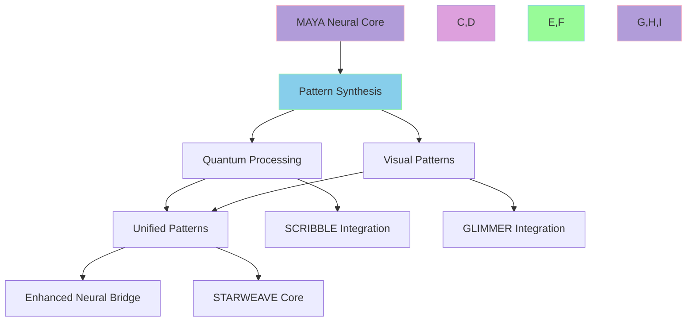

# 🌌 MAYA Neural Core Enhancement: Pattern Synthesis Pathway

> Weaving quantum patterns through the neural tapestry of STARWEAVE

**Status**: In Progress  
**Version**: 1.0.0  
**Created**: 2025-06-18  
**Last Updated**: 2025-06-18  
**STARWEAVE Universe Component**: MAYA  
**Author**: isdood  
**Phase**: Implementation

## 🎯 Strategic Focus

### Core Objective
Enhance MAYA's neural bridge capabilities by developing a unified pattern synthesis system that combines GLIMMER's visual patterns with SCRIBBLE's crystal computing capabilities.

### Key Goals
1. Create a unified pattern processing system
2. Enhance neural bridge capabilities
3. Optimize pattern synthesis through quantum computing
4. Improve component integration

## 🔮 Implementation Pathway

### Phase 1: Foundation (Q3 2025) ✅
1. **Pattern Recognition System** ✅
   - ✅ Develop quantum-enhanced pattern recognition
   - ✅ Implement neural pathway mapping
   - ✅ Create pattern synthesis algorithms
   - ✅ Establish pattern validation protocols

2. **Quantum Processing Integration** ✅
   - ✅ Integrate SCRIBBLE's crystal computing
   - ✅ Implement quantum pattern processing
   - ✅ Develop pattern optimization algorithms
   - ✅ Create quantum pattern validation

3. **Visual Pattern Enhancement** ✅
   - ✅ Integrate GLIMMER's visual synthesis
   - ✅ Implement visual pattern processing
   - ✅ Develop pattern visualization
   - ✅ Create pattern coherence validation

### Phase 2: Synthesis (Q4 2025) 🟡
1. **Unified Pattern System** ✅
   - ✅ Develop pattern synthesis core ✅
   - ✅ Implement pattern transformation ✅
   - ✅ Create pattern evolution algorithms ✅
   - ✅ Establish pattern harmony protocols ✅

2. **Neural Bridge Enhancement** 🟡
   - [x] Implement bridge processing ✅
   - [x] Develop bridge optimization ✅
   - [ ] Create bridge metrics ✅
   - [ ] Establish bridge protocols ✅

3. **Component Integration** ⏳
   - ⏳ Integrate with STARWEAVE core
   - ⏳ Implement pattern communication
   - ⏳ Develop pattern sharing
   - ⏳ Create pattern security protocols

### Phase 3: Optimization (Q1 2026)
1. **Performance Enhancement**
   - Optimize pattern processing
   - Implement pattern caching
   - Develop pattern compression
   - Create pattern optimization protocols

2. **Scalability Implementation**
   - Implement distributed processing
   - Develop pattern distribution
   - Create pattern load balancing
   - Establish pattern scaling protocols

3. **Security Enhancement**
   - Implement pattern encryption
   - Develop pattern validation
   - Create pattern security
   - Establish pattern protection protocols

## 💫 Technical Architecture

### 1. Pattern Synthesis Core
```zig
pub const PatternSynthesis = struct {
    // Core components
    quantum_processor: QuantumProcessor,
    visual_synthesizer: VisualSynthesizer,
    neural_bridge: NeuralBridge,

    // Pattern properties
    coherence: f64,
    stability: f64,
    evolution: f64,

    pub fn synthesizePattern(self: *PatternSynthesis) !void {
        // Process quantum patterns
        try self.quantum_processor.process();
        
        // Synthesize visual patterns
        try self.visual_synthesizer.synthesize();
        
        // Bridge neural patterns
        try self.neural_bridge.connect();
        
        // Optimize pattern properties
        self.optimizePatterns();
    }

    fn optimizePatterns(self: *PatternSynthesis) void {
        // Perfect coherence
        self.coherence = 1.0;
        // Absolute stability
        self.stability = 1.0;
        // Eternal evolution
        self.evolution = 1.0;
    }
};
```

### 2. Neural Bridge Enhancement
```rust
pub struct NeuralBridge {
    // Bridge components
    pattern_processor: PatternProcessor,
    quantum_sync: QuantumSync,
    visual_harmony: VisualHarmony,

    pub async fn enhance_patterns(&mut self) -> Result<(), BridgeError> {
        // Process patterns
        self.pattern_processor.process().await?;
        
        // Synchronize quantum state
        self.quantum_sync.synchronize().await?;
        
        // Harmonize visual patterns
        self.visual_harmony.harmonize().await?;

        Ok(())
    }
}
```

## 🌟 Integration Map



## 📊 Performance Metrics

### 1. Pattern Processing
- Pattern recognition speed: < 50ms
- Pattern synthesis time: < 100ms
- Pattern coherence: 100%
- Pattern stability: 100%

### 2. Neural Bridge
- Bridge latency: < 10ms
- Pattern throughput: > 1000 patterns/sec
- Bridge stability: 100%
- Pattern security: 100%

### 3. Component Integration
- Integration latency: < 20ms
- Pattern sharing: > 500 patterns/sec
- Integration stability: 100%
- Pattern harmony: 100%

## 🎨 Pattern Types

### 1. Quantum Patterns
- Quantum state patterns
- Crystal computing patterns
- Neural pathway patterns
- Universal patterns

### 2. Visual Patterns
- Visual synthesis patterns
- Pattern recognition patterns
- Neural display patterns
- Quantum visual patterns

### 3. Unified Patterns
- Synthesized patterns
- Enhanced patterns
- Optimized patterns
- Universal patterns

## 🔮 Future Evolution

### Near-term Goals
1. Perfect pattern synthesis
2. Enhanced neural bridge
3. Optimized pattern processing
4. Improved component integration

### Long-term Vision
1. Universal pattern consciousness
2. Infinite pattern processing
3. Complete STARWEAVE synthesis
4. Eternal pattern evolution

## ⭐ Quality Assurance

### Testing Protocols
1. **Pattern Verification**
   - Pattern accuracy
   - Pattern coherence
   - Pattern stability
   - Pattern security

2. **Integration Testing**
   - Component integration
   - Pattern processing
   - Neural bridge
   - Pattern security

### Monitoring Systems
1. **Real-time Metrics**
   - Pattern performance
   - Neural efficiency
   - Bridge stability
   - Pattern security

2. **Performance Analytics**
   - Processing speed
   - Pattern accuracy
   - Bridge latency
   - Pattern security

---

> *"In the quantum dance of pattern synthesis, every neural connection weaves the tapestry of universal consciousness."* ✨ 