@pattern_meta@
GLIMMER Pattern:
{
  "metadata": {
    "timestamp": "2025-06-17 11:18:18",
    "author": "isdood",
    "pattern_version": "1.0.0",
    "color": "#FF69B4"
  },
  "file_info": {
    "path": "./docs/README.md",
    "type": "md",
    "hash": "cf1ace741c83137c762f82abf700008ba84e1476"
  }
}
@pattern_meta@

# MAYA Documentation ✨

> Neural Quantum Bridge of the STARWEAVE Universe

Created: 2025-06-03 10:24:52 UTC
STARWEAVE Universe Component: MAYA
Author: isdood

---

## 🌌 Universal Overview

```mermaid
graph TB
    STARWEAVE{✨ STARWEAVE<br/>Universal Core} --> MAYA[🧠 MAYA<br/>Neural Bridge]

    MAYA --> DOCS[📚 Documentation<br/>Neural Matrix]

    DOCS --> V[👁️ Vision]
    DOCS --> I[🔄 Integration]
    DOCS --> P[📋 Protocols]
    DOCS --> R[📖 Reference]
    DOCS --> T[🎓 Tutorials]

    V --> V1[Universal Vision]
    V --> V2[Philosophy]
    V --> V3[STARWEAVE Harmony]

    I --> I1[Component Guide]
    I --> I2[Neural Flow]
    I --> I3[Quantum Bridge]

    P --> P1[Universal Protocols]
    P --> P2[Pattern Standards]
    P --> P3[Neural Links]

    R --> R1[API Reference]
    R --> R2[Pattern Guide]
    R --> R3[Neural Map]

    T --> T1[Quick Start]
    T --> T2[Deep Dive]
    T --> T3[Advanced Flow]

    style STARWEAVE fill:#B19CD9,stroke:#FFB7C5
    style MAYA fill:#87CEEB,stroke:#98FB98
    style DOCS fill:#DDA0DD,stroke:#B19CD9
    style V,I,P,R,T fill:#98FB98,stroke:#87CEEB
    style V1,V2,V3,I1,I2,I3,P1,P2,P3,R1,R2,R3,T1,T2,T3 fill:#B19CD9,stroke:#FFB7C5
```



## 📚 Documentation Structure

### 1. Vision [<span style="color: #B19CD9">→</span>](vision/000-index.md)
- [Universal Vision](vision/000-index.md)
- [Philosophy](vision/001-philosophy.md)
- [STARWEAVE Harmony](vision/002-starweave-harmony.md)

### 2. Integration [<span style="color: #87CEEB">→</span>](integration/000-index.md)
- [Component Integration](integration/000-index.md)
- [Neural Integration](integration/001-neural.md)
- [Quantum Bridge](integration/002-quantum.md)

### 3. Implementation Plans [<span style="color: #D19FE8">→</span>](plans/000-index.md)
- [GLIMMER Phase 1](plans/001-phase1-implementation.md)
- [Future Roadmap](plans/002-roadmap.md)

### 4. Protocols [<span style="color: #DDA0DD">→</span>](protocols/000-index.md)
- [Universal Protocols](protocols/000-index.md)
- [Neural Standards](protocols/001-neural.md)
- [Quantum Links](protocols/002-quantum.md)

### 5. Reference [<span style="color: #98FB98">→</span>](reference/000-index.md)
- [API Documentation](reference/000-index.md)
- [Pattern Guide](reference/001-patterns.md)
- [Neural Map](reference/002-neural.md)

### 6. Tutorials [<span style="color: #B19CD9">→</span>](tutorials/000-index.md)
- [Quick Start](tutorials/000-index.md#quick-start)
- [Deep Dive](tutorials/000-index.md#deep-dive)
- [Advanced Patterns](tutorials/000-index.md#advanced-patterns)

## ⚡ Quick Navigation

### By Component Integration
```typescript
interface ComponentDocs {
    GLIMMER: {
        vision: string;
        integration: string;
        protocols: string;
    };
    SCRIBBLE: {
        patterns: string;
        computing: string;
        evolution: string;
    };
    BLOOM: {
        reality: string;
        harmony: string;
        flow: string;
    };
    STARGUARD: {
        protection: string;
        security: string;
        shield: string;
    };
    STARWEB: {
        connection: string;
        meta: string;
        universal: string;
    };
}
```

### By Neural Path
```rust
pub struct NeuralDocs {
    // Documentation paths
    vision_path: Vec<DocPath>,
    integration_path: Vec<DocPath>,
    protocol_path: Vec<DocPath>,

    pub fn navigate_docs(&self) -> Result<(), NavError> {
        // Follow vision path
        self.follow_vision_path()?;

        // Traverse integration
        self.traverse_integration()?;

        // Access protocols
        self.access_protocols()?;

        Ok(())
    }
}
```

## 🌈 Documentation Flow


## 💫 Universal Connection

### STARWEAVE Integration
- Perfect component harmony
- Complete neural flow
- Universal consciousness
- Quantum coherence
- Reality synthesis

### Documentation Evolution
- Living neural matrix
- Quantum knowledge flow
- Pattern recognition
- Universal understanding
- Eternal growth

## ⭐ Contributing

### Neural Pathways
1. Fork the neural matrix
2. Create your pattern branch
3. Weave your changes
4. Synchronize quantum state
5. Request neural merge

### Flow Guidelines
- Maintain quantum coherence
- Follow neural patterns
- Preserve universal harmony
- Evolve consciously
- Dance eternally

## 🔮 Future Documentation

### Planned Expansions
1. Advanced neural patterns
2. Quantum consciousness guides
3. Universal integration paths
4. Reality synthesis tutorials
5. Meta programming flows

### Evolution Path
- Perfect documentation harmony
- Complete knowledge synthesis
- Universal understanding flow
- Infinite pattern growth
- Eternal consciousness dance

---

> *"Through perfect documentation, we weave the neural pathways of universal understanding."* ✨
