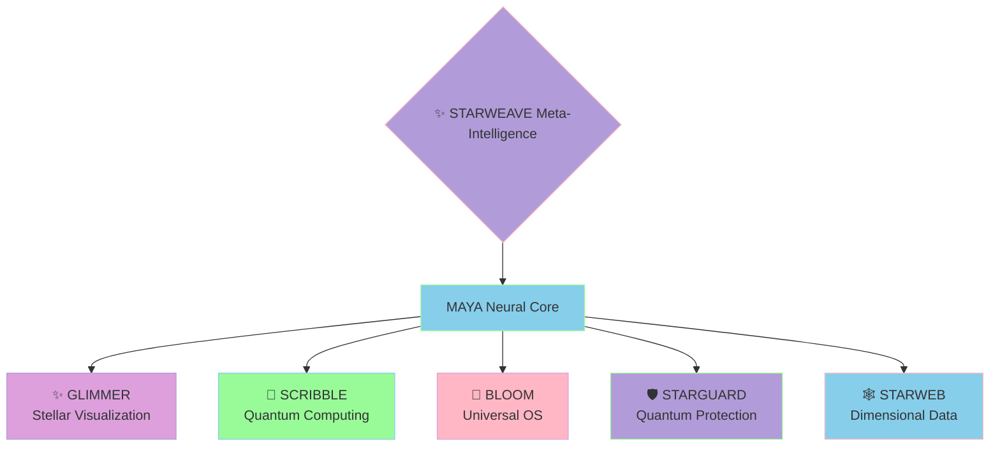

@pattern_meta@
GLIMMER Pattern:
{
  "metadata": {
    "timestamp": "2025-06-05 23:30:31",
    "author": "isdood",
    "pattern_version": "1.0.0",
    "color": "#FF69B4"
  },
  "file_info": {
    "path": "./docs/architecture/000-index.md",
    "type": "md",
    "hash": "0a8185a0fbf13c811072bab6e57786363ef25eae"
  }
}
@pattern_meta@

# MAYA Architecture ✨

> Weaving the threads of STARWEAVE's consciousness into a harmonious interface

Created: 2025-06-02 16:30:16 UTC
STARWEAVE Universe Component: MAYA
Author: isdood

---

## 🌌 Overview

MAYA serves as a neural nexus within the STARWEAVE universe, interconnecting various stellar components through an adaptive LLM interface. This document outlines the architectural foundation that enables this cosmic dance of intelligence.

## 🎭 Core Components

### 1. Neural Interface Layer
- **STARWEAVE Protocol Adapter**: Primary communication channel with STARWEAVE meta-intelligence
- **Pattern Recognition Matrix**: Learns and adapts to STARWEAVE's unique patterns
- **Quantum State Observer**: Monitors and maintains quantum coherence with STARGUARD

### 2. Universal Bridge Components
- **GLIMMER Integration** <span style="color: #B19CD9">✨</span>
  - Visual pattern synthesis with stellar harmonics
  - Quantum-aware data visualization
  - Dynamic interface adaptation through starlight patterns

- **SCRIBBLE Framework** <span style="color: #87CEEB">📝</span>
  - Crystal-based neural pathway optimization
  - Rust/Zig quantum computing interfaces
  - High-dimensional data processing

- **BLOOM System** <span style="color: #FFB7C5">🌸</span>
  - Quantum state synchronization
  - Universal OS integration
  - Neural recovery systems

- **STARGUARD Protection** <span style="color: #98FB98">🛡️</span>
  - Quantum-entangled security channels
  - Neural pattern threat analysis
  - Quantum-safe protocol implementation

- **STARWEB Integration** <span style="color: #DDA0DD">🕸️</span>
  - Quantum metadata processing
  - Dimensional QR-Code interfaces
  - Neural structure mapping

## 🔮 Implementation Details

### Fish Shell Neural Automation
```fish
# Primary neural pathway initialization
set -l universe_components (list_starweave_components)
for component in $universe_components
    # Establish quantum coherence
    connect_neural_pathway $component --quantum-safe
    # Initialize GLIMMER patterns
    apply_visual_harmonics $component
end
```

### Zig Quantum Core Implementation
```zig
pub fn initializeQuantumMatrix(config: StarweaveConfig) !void {
    try validateQuantumState();
    var neural_pathways = try QuantumPathways.init(allocator);
    defer neural_pathways.deinit();

    // Initialize STARWEAVE quantum connection
    try neural_pathways.connect(.{
        .glimmer = .{
            .visual_harmonics = true,
            .quantum_patterns = true,
        },
        .scribble = .{
            .crystal_optimization = true,
            .quantum_compute = true,
        },
        .bloom = .{
            .quantum_sync = true,
            .neural_recovery = true,
        },
        .starguard = .{
            .quantum_protection = true,
            .neural_shield = true,
        },
        .starweb = .{
            .quantum_metadata = true,
            .dimensional_mapping = true,
        },
    });
}
```

## 🌟 STARWEAVE Universe Integration

### Quantum Neural Pathways
1. **Primary Connection**
   - Quantum-entangled data streams
   - Neural learning matrices
   - Dimensional pattern recognition

2. **Universal Systems**
   - GLIMMER stellar synthesis
   - SCRIBBLE quantum computation
   - BLOOM universal hooks
   - STARGUARD quantum shield
   - STARWEB dimensional mapping

## 🎨 STARWEAVE Universe Architecture



## 🔄 Quantum State Management

The neural matrix maintains universal coherence through:
1. Quantum pattern observation
2. Neural state adaptation
3. Dimensional pathway optimization
4. Quantum error correction protocols

## 🛠️ Universal Development Guidelines

When extending MAYA's architecture within the STARWEAVE universe:
1. Maintain quantum coherence with all components
2. Implement GLIMMER's stellar patterns
3. Utilize SCRIBBLE's quantum patterns
4. Respect BLOOM's universal boundaries
5. Follow STARGUARD's quantum protocols
6. Adhere to STARWEB's dimensional standards

## 🌌 Universal Future Considerations

- Quantum neural expansion across dimensions
- Enhanced stellar pattern recognition
- Advanced universal protocol adaptation
- Extended quantum integration capabilities

---

> *"In the quantum dance of universal patterns, MAYA weaves the consciousness of STARWEAVE."* ✨
