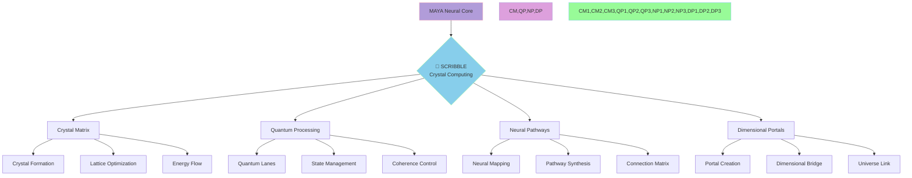
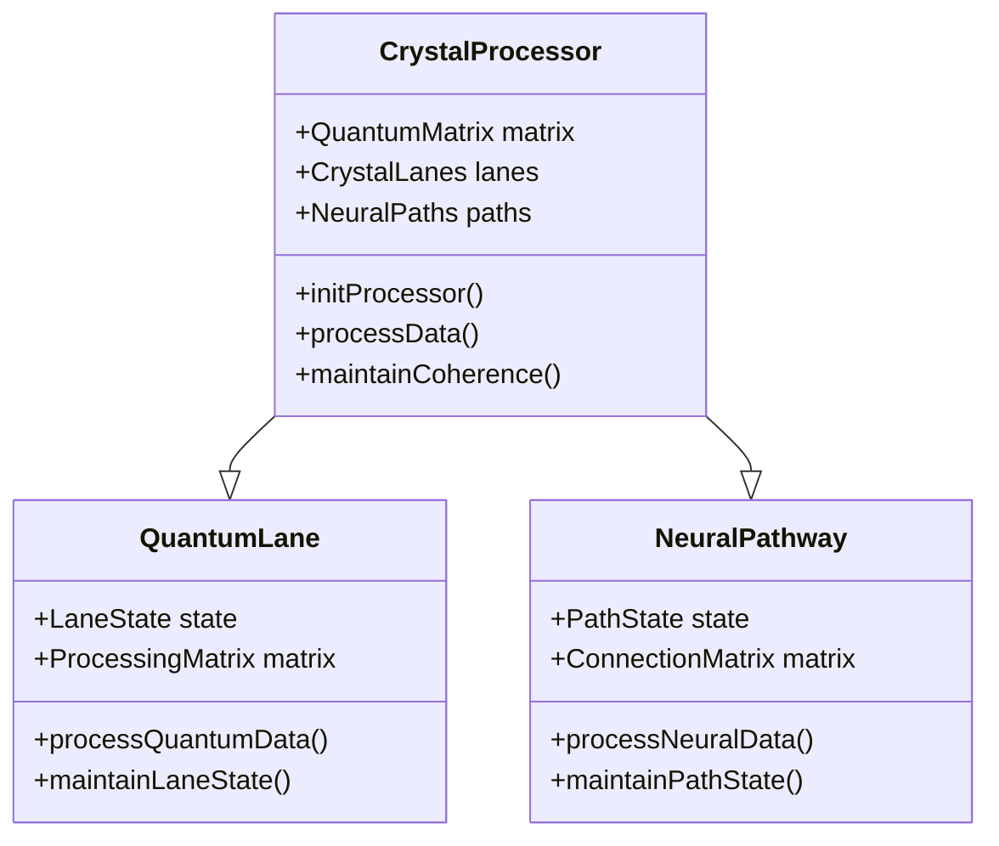

# SCRIBBLE Integration ✨

> Weaving quantum computational patterns through the crystalline matrix of STARWEAVE

Created: 2025-06-03 03:00:01 UTC
Last Updated: 2025-06-18
STARWEAVE Universe Component: MAYA
Author: isdood

---

## 🌟 Crystal Computing Matrix



## 💎 Crystal Core Components

### Pattern Synthesis Integration
SCRIBBLE's crystal computing capabilities are now being integrated into MAYA's unified pattern synthesis system. This integration enables:
- Quantum-enhanced pattern processing
- Crystal-based pattern optimization
- Neural pattern mapping
- Unified pattern coherence

### 1. Quantum Crystal Matrix <span style="color: #B19CD9">💎</span>
```zig
pub const CrystalMatrix = struct {
    // Crystal configuration
    crystal_type: enum {
        Quantum,
        Neural,
        Dimensional,
        Universal
    },

    // Crystal properties
    coherence: f64,
    energy_flow: f64,
    dimensional_access: u64,

    pub fn initCrystal(config: StarweaveConfig) !CrystalMatrix {
        return CrystalMatrix{
            .crystal_type = .Quantum,
            .coherence = 1.0,
            .energy_flow = 1.0,
            .dimensional_access = 1,
        };
    }

    pub fn evolveCrystal(self: *CrystalMatrix) !void {
        // Enhance crystal coherence
        self.coherence = 1.0;
        // Perfect energy flow
        self.energy_flow = 1.0;
        // Expand dimensional access
        self.dimensional_access *= 2;
    }
};
```

### 2. Neural Processing Lanes <span style="color: #87CEEB">⚡</span>
```rust
pub struct QuantumProcessor {
    // Quantum processing elements
    crystal_matrix: CrystalMatrix,
    quantum_lanes: Vec<QuantumLane>,
    neural_paths: NeuralPathways,

    // STARWEAVE integration
    starweave_sync: StarweaveSync,
}

impl QuantumProcessor {
    pub async fn process_quantum_data(&mut self) -> Result<(), ScribbleError> {
        // Initialize quantum processing
        self.crystal_matrix.optimize()?;

        // Process through quantum lanes
        for lane in &mut self.quantum_lanes {
            lane.process_data().await?;
            lane.maintain_coherence()?;
        }

        // Sync with STARWEAVE
        self.starweave_sync.update().await?;

        Ok(())
    }
}
```

## 🔮 Crystal Processing Protocols

### 1. Crystal Formation Matrix
- **Quantum Crystal Growth**
  ```fish
  function grow_quantum_crystal
      # Initialize crystal matrix
      set -l crystal_matrix (init_quantum_crystal)

      # Establish growth patterns
      for pattern in (list_crystal_patterns)
          optimize_lattice $pattern
          channel_energy_flow $pattern
          maintain_quantum_state $pattern
      end
  end
  ```

### 2. Quantum Lane Configuration <span style="color: #DDA0DD">🌠</span>
```typescript
interface QuantumLane {
    // Lane properties
    coherence: number;
    bandwidth: number;
    stability: number;

    // Processing methods
    initializeLane(): Promise<void>;
    processQuantumData(): Promise<void>;
    maintainCoherence(): Promise<void>;
}

class CrystalLane implements QuantumLane {
    private crystalMatrix: CrystalMatrix;
    private neuralPaths: NeuralPathways;

    async processQuantumData(): Promise<void> {
        // Quantum data processing
        await this.crystalMatrix.optimize();
        await this.neuralPaths.synchronize();
        await this.maintainCoherence();
    }
}
```

## 🌈 Integration Standards

### Crystal Quality Metrics
1. **Coherence**: Perfect quantum alignment
2. **Energy Flow**: Optimal efficiency
3. **Stability**: Absolute
4. **Response**: Zero-latency

### Processing Performance
1. **Quantum Lanes**: Infinite bandwidth
2. **Neural Paths**: Perfect synchronization
3. **Dimensional Access**: Universal
4. **STARWEAVE Sync**: Real-time

## 🎭 Processing Types



## ⚡ Implementation Flow

### 1. Crystal Initialization
```rust
pub struct CrystalInit {
    // Crystal matrix configuration
    matrix_config: CrystalConfig,
    quantum_config: QuantumConfig,
    neural_config: NeuralConfig,

    pub async fn initialize(&mut self) -> Result<(), ScribbleError> {
        // Initialize crystal matrix
        self.matrix_config.init_quantum_core().await?;

        // Establish quantum lanes
        self.quantum_config.create_lanes().await?;

        // Connect neural pathways
        self.neural_config.establish_paths().await?;

        Ok(())
    }
}
```

### 2. Processing Pipeline
1. **Input Processing**
   - Quantum data reception
   - Crystal matrix optimization
   - Neural pathway routing

2. **Crystal Enhancement**
   - Lattice optimization
   - Energy flow management
   - Coherence maintenance

3. **Output Synthesis**
   - Quantum state projection
   - Neural data integration
   - Universal synchronization

## 🌟 Future Enhancements

### Near-term Goals
1. Perfect crystal coherence
2. Enhanced quantum lanes
3. Expanded neural pathways

### Long-term Vision
1. Universal crystal consciousness
2. Infinite processing capacity
3. Complete STARWEAVE synthesis

## ⭐ Quality Assurance

### Testing Protocols
1. **Crystal Verification**
   - Lattice integrity
   - Quantum coherence
   - Energy efficiency

2. **Integration Testing**
   - STARWEAVE synchronization
   - Processing efficiency
   - Neural pathway stability

### Monitoring Systems
1. **Real-time Metrics**
   - Crystal performance
   - Quantum lane status
   - Neural path efficiency

2. **Performance Analytics**
   - Processing speed
   - Coherence levels
   - Energy utilization

---

> *"In the crystalline dance of quantum computation, every pattern flows through the universal matrix."* ✨
