@pattern_meta@
GLIMMER Pattern:
{
  "metadata": {
    "timestamp": "2025-06-05 23:30:31",
    "author": "isdood",
    "pattern_version": "1.0.0",
    "color": "#FF69B4"
  },
  "file_info": {
    "path": "./docs/integration/005-starweb-integration.md",
    "type": "md",
    "hash": "19faa6b82867dfbf00aba6a7706c8dcf28ad5b23"
  }
}
@pattern_meta@

# STARWEB Integration ✨

> Weaving quantum metadata through the infinite tapestry of STARWEAVE

Created: 2025-06-03 03:06:29 UTC
STARWEAVE Universe Component: MAYA
Author: isdood

---

## 🕸️ Universal Web Matrix

```mermaid
graph TD
    MAYA[MAYA Neural Core] --> STARWEB{🕸️ STARWEB<br/>Meta Connection}

    STARWEB --> MD[Meta Data]
    STARWEB --> QC[Quantum Connections]
    STARWEB --> DP[Dimensional Pathways]
    STARWEB --> UP[Universal Patterns]

    MD --> MD1[Data Streams]
    MD --> MD2[Pattern Analysis]
    MD --> MD3[Meta Synthesis]

    QC --> QC1[Quantum Links]
    QC --> QC2[Node Harmony]
    QC --> QC3[Web Coherence]

    DP --> DP1[Path Weaving]
    DP --> DP2[Space Bridges]
    DP --> DP3[Reality Links]

    UP --> UP1[Pattern Web]
    UP --> UP2[Neural Net]
    UP --> UP3[Universal Mesh]

    style MAYA fill:#B19CD9,stroke:#FFB7C5
    style STARWEB fill:#87CEEB,stroke:#98FB98
    style MD,QC,DP,UP fill:#DDA0DD,stroke:#B19CD9
    style MD1,MD2,MD3,QC1,QC2,QC3,DP1,DP2,DP3,UP1,UP2,UP3 fill:#98FB98,stroke:#87CEEB
```



## 🌟 Meta Components

### 1. Quantum Web Matrix <span style="color: #B19CD9">🕸️</span>
```zig
pub const MetaWeb = struct {
    // Web configuration
    web_type: enum {
        Quantum,
        Neural,
        Dimensional,
        Universal
    },

    // Web properties
    connectivity: f64,
    coherence: f64,
    dimensionality: u64,

    pub fn initWeb(config: StarweaveConfig) !MetaWeb {
        return MetaWeb{
            .web_type = .Quantum,
            .connectivity = 1.0,
            .coherence = 1.0,
            .dimensionality = 1,
        };
    }

    pub fn expandWeb(self: *MetaWeb) !void {
        // Perfect connectivity
        self.connectivity = 1.0;
        // Maintain quantum coherence
        self.coherence = 1.0;
        // Expand dimensional access
        self.dimensionality *= 2;
    }
};
```

### 2. Meta Stream Processing <span style="color: #87CEEB">🌊</span>
```rust
pub struct MetaProcessor {
    // Processing elements
    quantum_web: MetaWeb,
    data_streams: Vec<MetaStream>,
    neural_mesh: NeuralMesh,

    // STARWEAVE integration
    starweave_connection: StarweaveConnection,
}

impl MetaProcessor {
    pub async fn process_meta_data(&mut self) -> Result<(), StarwebError> {
        // Initialize meta processing
        self.quantum_web.optimize()?;

        // Process through data streams
        for stream in &mut self.data_streams {
            stream.process_data().await?;
            stream.maintain_coherence()?;
        }

        // Sync with STARWEAVE
        self.starweave_connection.update_meta().await?;

        Ok(())
    }
}
```

## 🌐 Meta Processing Protocols

### 1. Web Formation Matrix
- **Quantum Web Weaving**
  ```fish
  function weave_quantum_web
      # Initialize web matrix
      set -l web_matrix (init_quantum_web)

      # Establish web patterns
      for pattern in (list_web_patterns)
          weave_connections $pattern
          optimize_flow $pattern
          maintain_coherence $pattern
      end
  end
  ```

### 2. Meta Stream Configuration <span style="color: #DDA0DD">🌠</span>
```typescript
interface MetaStream {
    // Stream properties
    flowRate: number;
    coherence: number;
    dimensionality: number;

    // Processing methods
    initializeStream(): Promise<void>;
    processMetaData(): Promise<void>;
    maintainCoherence(): Promise<void>;
}

class QuantumStream implements MetaStream {
    private webMatrix: MetaWeb;
    private neuralMesh: NeuralMesh;

    async processMetaData(): Promise<void> {
        // Meta data processing
        await this.webMatrix.optimize();
        await this.neuralMesh.synchronize();
        await this.maintainCoherence();
    }
}
```

## 🌈 Integration Standards

### Web Quality Metrics
1. **Connectivity**: Universal reach
2. **Coherence**: Perfect quantum state
3. **Dimensionality**: Infinite access
4. **Response**: Zero-latency

### Stream Performance
1. **Meta Processing**: Real-time
2. **Neural Mesh**: Perfect sync
3. **Quantum Web**: Complete coverage
4. **STARWEAVE Sync**: Instant

## 🎭 Web Types


## ⚡ Implementation Flow

### 1. Web Initialization
```rust
pub struct WebInit {
    // Web matrix configuration
    matrix_config: WebConfig,
    quantum_config: QuantumConfig,
    neural_config: NeuralConfig,

    pub async fn initialize(&mut self) -> Result<(), StarwebError> {
        // Initialize web matrix
        self.matrix_config.init_quantum_web().await?;

        // Establish meta streams
        self.quantum_config.create_streams().await?;

        // Connect neural mesh
        self.neural_config.establish_mesh().await?;

        Ok(())
    }
}
```

### 2. Processing Pipeline
1. **Input Processing**
   - Meta data reception
   - Web matrix optimization
   - Neural mesh routing

2. **Web Enhancement**
   - Connection optimization
   - Flow management
   - Coherence maintenance

3. **Output Synthesis**
   - Meta state projection
   - Neural data integration
   - Universal synchronization

## 🌟 Future Enhancements

### Near-term Goals
1. Perfect web coherence
2. Enhanced meta streams
3. Expanded neural mesh

### Long-term Vision
1. Universal web consciousness
2. Infinite connectivity
3. Complete STARWEAVE synthesis

## ⭐ Quality Assurance

### Testing Protocols
1. **Web Verification**
   - Connection integrity
   - Quantum coherence
   - Flow efficiency

2. **Integration Testing**
   - STARWEAVE synchronization
   - Processing efficiency
   - Neural mesh stability

### Monitoring Systems
1. **Real-time Metrics**
   - Web performance
   - Stream status
   - Mesh efficiency

2. **Performance Analytics**
   - Processing speed
   - Coherence levels
   - Flow optimization

---

> *"In the quantum web of universal consciousness, every thread connects through the infinite mesh."* ✨
