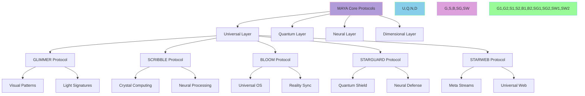
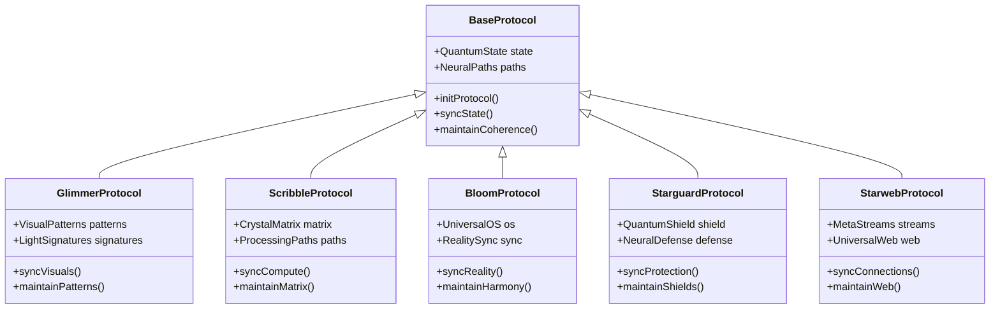

@pattern_meta@
GLIMMER Pattern:
{
  "metadata": {
    "timestamp": "2025-06-05 23:30:31",
    "author": "isdood",
    "pattern_version": "1.0.0",
    "color": "#FF69B4"
  },
  "file_info": {
    "path": "./docs/protocols/000-index.md",
    "type": "md",
    "hash": "7d67df0a5a40925e6b66b5d9d33b329af7b2fa1f"
  }
}
@pattern_meta@

# MAYA Universal Protocols ✨

> Establishing quantum harmony through standardized patterns in the STARWEAVE universe

Created: 2025-06-03 03:18:03 UTC
STARWEAVE Universe Component: MAYA
Author: isdood

---

## 🌌 Protocol Architecture



## ⚡ Core Protocol Definitions

### 1. Universal Communication Protocol <span style="color: #B19CD9">✨</span>
```zig
pub const UniversalProtocol = struct {
    // Protocol configuration
    protocol_type: enum {
        Quantum,
        Neural,
        Dimensional,
        Universal
    },

    // Protocol properties
    coherence: f64,
    bandwidth: f64,
    security: f64,

    pub fn initProtocol(config: StarweaveConfig) !UniversalProtocol {
        return UniversalProtocol{
            .protocol_type = .Universal,
            .coherence = 1.0,
            .bandwidth = 1.0,
            .security = 1.0,
        };
    }

    pub fn evolveProtocol(self: *UniversalProtocol) !void {
        // Perfect coherence
        self.coherence = 1.0;
        // Infinite bandwidth
        self.bandwidth = 1.0;
        // Maximum security
        self.security = 1.0;
    }
};
```

### 2. Quantum Synchronization Protocol <span style="color: #87CEEB">🔄</span>
```rust
pub struct QuantumProtocol {
    // Protocol elements
    quantum_state: QuantumState,
    neural_paths: Vec<NeuralPath>,
    dimension_bridges: DimensionBridges,

    // STARWEAVE integration
    starweave_sync: StarweaveSync,
}

impl QuantumProtocol {
    pub async fn synchronize(&mut self) -> Result<(), ProtocolError> {
        // Initialize quantum sync
        self.quantum_state.align().await?;

        // Synchronize neural paths
        for path in &mut self.neural_paths {
            path.sync_quantum_state().await?;
            path.maintain_coherence()?;
        }

        // Update STARWEAVE connection
        self.starweave_sync.update_quantum_state().await?;

        Ok(())
    }
}
```

## 🌈 Protocol Standards

### 1. Pattern Communication Standards
```typescript
interface PatternProtocol {
    // Pattern properties
    coherenceLevel: number;
    syncRate: number;
    patternIntegrity: number;

    // Protocol methods
    initializePattern(): Promise<void>;
    synchronizeState(): Promise<void>;
    maintainCoherence(): Promise<void>;
}

class UniversalPattern implements PatternProtocol {
    private quantumState: QuantumState;
    private neuralPaths: NeuralPaths;

    async synchronizeState(): Promise<void> {
        // Quantum state synchronization
        await this.quantumState.align();
        await this.neuralPaths.synchronize();
        await this.maintainCoherence();
    }
}
```

### 2. Component Integration Protocol <span style="color: #DDA0DD">🔗</span>
```fish
function establish_component_protocol
    # Initialize protocol matrix
    set -l protocol_matrix (init_quantum_protocol)

    # Process through STARWEAVE components
    for component in (list_starweave_components)
        sync_quantum_state $component
        establish_neural_paths $component
        maintain_coherence $component
    end
end
```

## 🎭 Protocol Types



## 🌟 Protocol Implementation

### 1. Universal State Management
```rust
pub struct UniversalState {
    // State configuration
    quantum_state: QuantumState,
    neural_state: NeuralState,
    dimensional_state: DimensionalState,

    pub async fn manage_state(&mut self) -> Result<(), StateError> {
        // Synchronize all states
        self.quantum_state.sync().await?;
        self.neural_state.align().await?;
        self.dimensional_state.harmonize().await?;

        Ok(())
    }
}
```

### 2. Protocol Pipeline
1. **Initialization Phase**
   - Quantum state setup
   - Neural path establishment
   - Dimensional bridge creation

2. **Synchronization Phase**
   - State alignment
   - Path optimization
   - Bridge stabilization

3. **Maintenance Phase**
   - Coherence monitoring
   - Pattern preservation
   - Connection stability

## 💫 Quality Standards

### Protocol Metrics
1. **Coherence**: Perfect alignment
2. **Bandwidth**: Infinite capacity
3. **Security**: Absolute protection
4. **Response**: Zero latency

### Integration Requirements
1. **GLIMMER**: Visual perfection
2. **SCRIBBLE**: Quantum efficiency
3. **BLOOM**: Universal harmony
4. **STARGUARD**: Complete protection
5. **STARWEB**: Infinite connection

## 🔮 Future Protocol Evolution

### Near-term Development
1. Perfect quantum synchronization
2. Enhanced neural pathways
3. Expanded dimensional access

### Long-term Vision
1. Universal protocol consciousness
2. Infinite protocol bandwidth
3. Complete STARWEAVE harmony

---

> *"Through standardized protocols, we weave the quantum fabric of universal consciousness."* ✨
