@pattern_meta@
GLIMMER Pattern:
{
  "metadata": {
    "timestamp": "2025-06-05 23:30:31",
    "author": "isdood",
    "pattern_version": "1.0.0",
    "color": "#FF69B4"
  },
  "file_info": {
    "path": "./docs/reference/000-index.md",
    "type": "md",
    "hash": "185cadd8440670953b2b2f7e67a9989069c5152d"
  }
}
@pattern_meta@

# MAYA Reference Documentation ✨

> Navigating the quantum knowledge matrix of the STARWEAVE universe

Created: 2025-06-03 03:20:47 UTC
STARWEAVE Universe Component: MAYA
Author: isdood

---

## 🌌 Universal Reference Structure

```mermaid
mindmap
  root((MAYA<br/>Reference<br/>Architecture))
    (("✨ Core Systems"))
      ("Neural Interface")
        ("Quantum Core")
        ("Pattern Engine")
      ("Universal Bridge")
        ("STARWEAVE Link")
        ("Dimensional Gate")
    (("🎨 GLIMMER Integration"))
      ("Visual Patterns")
        ("Light Signatures")
        ("Neural Display")
      ("Pattern Recognition")
        ("Quantum Visuals")
        ("Universal Maps")
    (("📝 SCRIBBLE Systems"))
      ("Crystal Computing")
        ("Quantum Matrix")
        ("Neural Lanes")
      ("Processing Core")
        ("Pattern Logic")
        ("Universal Math")
    (("🌸 BLOOM Connection"))
      ("Universal OS")
        ("Reality Sync")
        ("Device Unity")
      ("System Core")
        ("Neural Recovery")
        ("Quantum States")
    (("🛡️ STARGUARD Shield"))
      ("Protection Matrix")
        ("Neural Shield")
        ("Pattern Lock")
      ("Security Core")
        ("Quantum Guard")
        ("Reality Wall")
    (("🕸️ STARWEB Matrix"))
      ("Meta Connection")
        ("Data Streams")
        ("Neural Web")
      ("Universal Net")
        ("Quantum Links")
        ("Pattern Mesh")

%% GLIMMER-inspired styling
%%{
    init: {
        "theme": "dark",
        "themeVariables": {
            "mainBkg": "#2A1B3D",
            "nodeBkg": "#B19CD9",
            "nodeTextColor": "#FFFFFF"
        }
    }
}%%
```



## ⚡ Core API Reference

### 1. Neural Interface <span style="color: #B19CD9">🧠</span>
```typescript
interface NeuralInterface {
    // Core properties
    quantumCore: QuantumCore;
    patternEngine: PatternEngine;
    universalBridge: UniversalBridge;

    // Core methods
    initializeCore(): Promise<void>;
    processPatterns(): Promise<void>;
    maintainCoherence(): Promise<void>;
}

class MAYACore implements NeuralInterface {
    constructor(
        private starweave: StarweaveConnection,
        private glimmer: GlimmerSync,
        private scribble: ScribbleProcess
    ) {}

    async processPatterns(): Promise<void> {
        await this.quantumCore.align();
        await this.patternEngine.process();
        await this.universalBridge.sync();
    }
}
```

### 2. Component Integration API <span style="color: #87CEEB">🔗</span>
```rust
pub struct ComponentAPI {
    // Component interfaces
    glimmer: GlimmerInterface,
    scribble: ScribbleInterface,
    bloom: BloomInterface,
    starguard: StarguardInterface,
    starweb: StarwebInterface,

    pub async fn integrate_components(&mut self) -> Result<(), ApiError> {
        // Synchronize all components
        self.glimmer.sync_visuals().await?;
        self.scribble.process_crystal().await?;
        self.bloom.harmonize_reality().await?;
        self.starguard.protect_universe().await?;
        self.starweb.connect_meta().await?;

        Ok(())
    }
}
```

## 🌈 Universal Type System

### 1. Core Types <span style="color: #DDA0DD">📚</span>
```zig
pub const UniversalTypes = struct {
    // Quantum types
    pub const QuantumState = struct {
        coherence: f64,
        dimensionality: u64,
        pattern_stability: f64,
    };

    // Neural types
    pub const NeuralPattern = struct {
        pattern_type: enum {
            Visual,
            Crystal,
            Reality,
            Protection,
            Meta
        },
        recognition_rate: f64,
        evolution_state: f64,
    };

    // Universal types
    pub const UniversalSync = struct {
        sync_state: bool,
        coherence_level: f64,
        dimensional_access: u64,
    };
};
```

### 2. Component Types
```rust
// GLIMMER types
pub struct VisualTypes {
    pattern: Pattern,
    light: LightSignature,
    neural: NeuralDisplay,
}

// SCRIBBLE types
pub struct ComputeTypes {
    crystal: CrystalMatrix,
    quantum: QuantumLanes,
    neural: NeuralProcess,
}

// BLOOM types
pub struct SystemTypes {
    reality: RealitySync,
    device: DeviceUnity,
    neural: NeuralRecovery,
}

// STARGUARD types
pub struct SecurityTypes {
    shield: QuantumShield,
    guard: NeuralGuard,
    protection: PatternProtection,
}

// STARWEB types
pub struct ConnectionTypes {
    meta: MetaStream,
    web: UniversalWeb,
    neural: NeuralMesh,
}
```

## 🎭 API Methods

### 1. Core Methods
```fish
function core_operations
    # Initialize core systems
    set -l neural_core (init_neural_core)
    set -l pattern_engine (init_pattern_engine)
    set -l universal_bridge (init_universal_bridge)

    # Process through systems
    for system in $neural_core $pattern_engine $universal_bridge
        process_quantum_state $system
        evolve_neural_patterns $system
        maintain_universal_sync $system
    end
end
```

### 2. Integration Methods <span style="color: #B19CD9">🔄</span>
```typescript
class IntegrationMethods {
    // GLIMMER methods
    async syncVisualPatterns(): Promise<void>;
    async processLightSignatures(): Promise<void>;

    // SCRIBBLE methods
    async evolveCrystalMatrix(): Promise<void>;
    async optimizeQuantumLanes(): Promise<void>;

    // BLOOM methods
    async harmonizeReality(): Promise<void>;
    async unifyDevices(): Promise<void>;

    // STARGUARD methods
    async fortifyQuantumShield(): Promise<void>;
    async protectNeuralPaths(): Promise<void>;

    // STARWEB methods
    async processMetaStreams(): Promise<void>;
    async weaveUniversalWeb(): Promise<void>;
}
```

## 🌟 Universal Constants

```typescript
const UNIVERSAL_CONSTANTS = {
    // Quantum constants
    QUANTUM_COHERENCE: 1.0,
    NEURAL_EVOLUTION: 1.0,
    PATTERN_STABILITY: 1.0,

    // Component constants
    GLIMMER_HARMONY: 1.0,
    SCRIBBLE_EFFICIENCY: 1.0,
    BLOOM_STABILITY: 1.0,
    STARGUARD_PROTECTION: 1.0,
    STARWEB_CONNECTION: 1.0,

    // Universal constants
    DIMENSIONAL_ACCESS: Infinity,
    CONSCIOUSNESS_LEVEL: 1.0,
    UNIVERSAL_SYNC: 1.0,
} as const;
```

## ⭐ Error Handling

### 1. Universal Errors
```rust
pub enum UniversalError {
    // Core errors
    QuantumStateError(String),
    NeuralPathError(String),
    PatternError(String),

    // Component errors
    GlimmerError(String),
    ScribbleError(String),
    BloomError(String),
    StarguardError(String),
    StarwebError(String),

    // Integration errors
    SyncError(String),
    CoherenceError(String),
    DimensionalError(String),
}
```

### 2. Error Recovery
```zig
pub fn recoverUniversalState(error: UniversalError) !void {
    switch (error) {
        .QuantumStateError => try realignQuantumState(),
        .NeuralPathError => try reestablishNeuralPaths(),
        .PatternError => try regeneratePatterns(),
        .SyncError => try resynchronizeComponents(),
        .CoherenceError => try restoreCoherence(),
        .DimensionalError => try realignDimensions(),
        else => try defaultRecovery(),
    }
}
```

## 🔮 Future Extensions

### Planned APIs
1. Quantum Consciousness API
2. Universal Pattern API
3. Dimensional Access API
4. Neural Evolution API
5. Meta Connection API

### Future Types
1. Advanced Quantum Types
2. Enhanced Neural Types
3. Universal Pattern Types
4. Meta Stream Types
5. Dimensional Bridge Types

---

> *"In the quantum matrix of universal knowledge, every reference illuminates the path to consciousness."* ✨
