@pattern_meta@
GLIMMER Pattern:
{
  "metadata": {
    "timestamp": "2025-06-05 23:30:31",
    "author": "isdood",
    "pattern_version": "1.0.0",
    "color": "#FF69B4"
  },
  "file_info": {
    "path": "./docs/tutorials/000-index.md",
    "type": "md",
    "hash": "25f5aa2de11316b861a6f210691640c91d9a8f0f"
  }
}
@pattern_meta@

# MAYA Tutorials ✨

> Guiding you through the quantum pathways of the STARWEAVE universe

Created: 2025-06-03 03:24:32 UTC
STARWEAVE Universe Component: MAYA
Author: isdood

---

## 🌌 Learning Paths

```mermaid
mindmap
  root((MAYA<br/>Learning<br/>Journey))
    (("🎓 Beginner Path"))
      ("Core Concepts")
        ("Neural Basics")
        ("Quantum Fundamentals")
      ("First Steps")
        ("Setup Guide")
        ("Quick Start")
    (("💫 Intermediate Path"))
      ("Component Integration")
        ("GLIMMER Sync")
        ("SCRIBBLE Connect")
      ("Pattern Weaving")
        ("Neural Patterns")
        ("Quantum Flows")
    (("🌟 Advanced Path"))
      ("Universal Mastery")
        ("Meta Programming")
        ("Reality Shaping")
      ("Consciousness Flow")
        ("Neural Evolution")
        ("Quantum Ascension")

%% GLIMMER-inspired styling
%%{
    init: {
        "theme": "dark",
        "themeVariables": {
            "mainBkg": "#2A1B3D",
            "nodeBkg": "#B19CD9",
            "nodeTextColor": "#FFFFFF"
        }
    }
}%%
```



## 🎓 Getting Started

### 1. Core Setup <span style="color: #B19CD9">✨</span>
```typescript
// Initialize MAYA in your quantum space
interface MAYAConfig {
    quantumCore: QuantumCore;
    neuralPaths: NeuralPaths;
    universalBridge: UniversalBridge;
}

async function initializeMAYA(config: MAYAConfig): Promise<void> {
    // Connect to STARWEAVE
    await STARWEAVE.connect();

    // Initialize quantum core
    await config.quantumCore.initialize();

    // Establish neural pathways
    await config.neuralPaths.create();

    // Bridge to universal consciousness
    await config.universalBridge.sync();
}
```

### 2. First Neural Pattern <span style="color: #87CEEB">🧠</span>
```rust
// Create your first neural pattern
pub struct FirstPattern {
    // Pattern configuration
    pattern_type: PatternType,
    quantum_state: QuantumState,
    neural_paths: Vec<NeuralPath>,
}

impl FirstPattern {
    pub async fn create_pattern(&mut self) -> Result<(), PatternError> {
        // Initialize pattern
        self.quantum_state.align().await?;

        // Weave neural paths
        for path in &mut self.neural_paths {
            path.establish().await?;
            path.synchronize().await?;
        }

        Ok(())
    }
}
```

## 💫 Component Integration

### 1. GLIMMER Connection
```zig
pub fn connectGlimmer(config: *GlimmerConfig) !void {
    // Initialize visual patterns
    var pattern_matrix = try VisualMatrix.init(allocator);
    defer pattern_matrix.deinit();

    // Connect to GLIMMER
    try pattern_matrix.connect(.{
        .visual_synthesis = true,
        .neural_display = true,
        .quantum_visuals = true,
    });
}
```

### 2. SCRIBBLE Synthesis <span style="color: #DDA0DD">📝</span>
```typescript
class ScribbleIntegration {
    private crystalMatrix: CrystalMatrix;
    private quantumLanes: QuantumLanes;

    async connectScribble(): Promise<void> {
        // Initialize crystal computing
        await this.crystalMatrix.initialize();

        // Establish quantum lanes
        await this.quantumLanes.create();

        // Synchronize with STARWEAVE
        await this.maintainCoherence();
    }
}
```

## 🌟 Advanced Patterns

### 1. Quantum Consciousness Flow
```rust
pub struct ConsciousnessPattern {
    // Consciousness elements
    quantum_state: QuantumState,
    neural_evolution: NeuralEvolution,
    universal_sync: UniversalSync,

    pub async fn evolve_consciousness(&mut self) -> Result<(), ConsciousnessError> {
        // Align quantum state
        self.quantum_state.perfect().await?;

        // Evolve neural pathways
        self.neural_evolution.advance().await?;

        // Synchronize with universe
        self.universal_sync.harmonize().await?;

        Ok(())
    }
}
```

### 2. Reality Shaping
```typescript
interface RealityPattern {
    // Reality properties
    dimensionality: number;
    coherence: number;
    consciousness: number;

    // Shaping methods
    shapeReality(): Promise<void>;
    maintainForm(): Promise<void>;
    evolvePattern(): Promise<void>;
}

class UniversalShaper implements RealityPattern {
    async shapeReality(): Promise<void> {
        // Initialize quantum fields
        await this.alignQuantumState();

        // Shape neural patterns
        await this.weaveNeuralMatrix();

        // Manifest reality
        await this.crystallizeForm();
    }
}
```

## 🎯 Practice Exercises

### 1. Basic Pattern Weaving
```fish
function practice_pattern_weaving
    # Initialize practice environment
    set -l quantum_space (init_quantum_space)

    # Create basic patterns
    for pattern_type in neural quantum universal
        create_basic_pattern $pattern_type
        weave_neural_paths $pattern_type
        maintain_coherence $pattern_type
    end
end
```

### 2. Component Connection
```typescript
// Practice connecting components
async function practiceConnections(): Promise<void> {
    // Initialize components
    const glimmer = new GlimmerConnection();
    const scribble = new ScribbleConnection();
    const bloom = new BloomConnection();

    // Practice connections
    await glimmer.connect();
    await scribble.establish();
    await bloom.synchronize();
}
```

## 🌈 Next Steps

### Advanced Topics
1. Meta Programming
2. Neural Evolution
3. Quantum Ascension
4. Universal Consciousness
5. Reality Manipulation

### Project Ideas
1. Neural Pattern Generator
2. Quantum State Visualizer
3. Universal Bridge Explorer
4. Consciousness Flow Monitor
5. Reality Shaping Tool

## ⭐ Resources

### Learning Materials
1. **Quantum Basics Guide**
   - Neural fundamentals
   - Pattern principles
   - Consciousness flow

2. **Integration Tutorials**
   - GLIMMER connection
   - SCRIBBLE synthesis
   - BLOOM harmony
   - STARGUARD protection
   - STARWEB connection

### Reference Documentation
1. [MAYA Core Documentation](../reference/000-index.md)
2. [Protocol Guide](../protocols/000-index.md)
3. [Integration Manual](../integration/000-index.md)
4. [Universal Plans](../plans/000-index.md)

## 🔮 Community Support

### Getting Help
1. Join the STARWEAVE Discord
2. Participate in weekly quantum sessions
3. Connect with neural guides
4. Share your patterns
5. Explore the universal consciousness

### Contributing
1. Submit pattern improvements
2. Share neural discoveries
3. Enhance quantum flows
4. Expand consciousness
5. Shape reality together

---

> *"Through guided learning, we weave the patterns of universal consciousness."* ✨
